# Стартуем, практика 1
## Step 0: Подготовка
### Так как у меня есть старый ПК, подключенный к телеку, то я снёс с него винду и поставил Endevoure (сборка на Arch). 

    Я сначала наивно ставил сборку линукс второй системой. Но конечно же загрузчик винды решил умереть, попытка реанимировать через поиск нужных битов в памяти привела только к потере пары часов времени.


### Далее я понял, что хочу работать со своего основного ПК, поэтому создал локальное ssh подключение внутри VS Code к линукс машине. И уже через это подключение привязал гитхаб к ней же. 

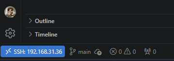

### Ура, линукс - крутится, коммиты - мутятся! 
Пишем сервис на Go по ТЗ, с тремя основными эндпойнтами. 
Еще добавил stopBurn, чтобы прервать бесконечный цикл burn. 

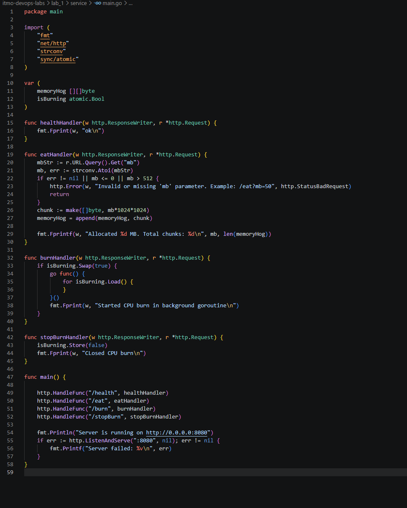

## Step 1: Запускаем локалхост, чекаем - жив ли наш сервис?

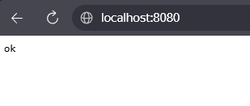

Отлично, /health отрабатывает штатно. 

#### Ищем PID нашего процесса: 
```bash
ps -ef
```

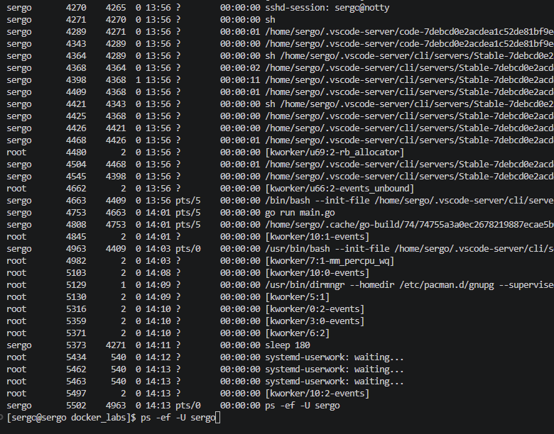

Наш сервис - go run main.go с PID 4753. Также вижу процессы как ssh подключения, так и процессы VS Code на хосте.
Оппа - я попался. go run main.go - это процесс обертка с временным бинарником. Кажется это процесс с PID 4808. 

Но лучше перезапущу сервис, собрав бинарник. /health отдает ок - отлично. 
Смотрим PID:

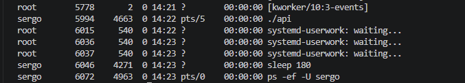

### Ага, вот и наш процесс сервиса "./api" с PID 5994.


## Step 2: Изучаем namespaces

### Создадим новое пространство имён следующей командой и сразу зададим имя хоста
```bash
unshare --pid --net --mount --uts --ipc --user --map-root-user --fork --mount-proc bash
hostname mycontainer
```
Смотрим что у нас по процессам внутри и название нашего хоста:

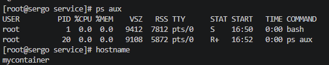

Отлично! Всего два процесса, причём наш bash стоит первым номером. 
А что по сетевым интерфейсам?

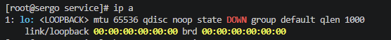

Пусто! Значит всё сделал верно. 
Также пользователь, который создавал пространство имён, теперь стал root пользователем внутри. 

Запускаем наш сервис внутри mycontainer и смотрим на хосте, какой PID назначен процессу.

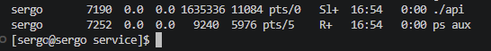

### Попався! PID нашего api - 7190

### А что за волшебные флаги я вводил, когда изолировал мой процесс?

- ```--pid``` - создаем наше новое пространство PID, где наш процесс будет самым главным на районе
- ```--net``` - изолируем сетевое пространство
- ```--mount``` - изолируем точки монтирования
- ```--uts``` - изолируем наш хост
- ```--ipc``` - изолируем межпроцессорное взаимодействие
- ```--user``` - изолируем наших юзеров внутри
- ```--map-root-user``` - отмечаем, что юзер, который создал этот контейнер, теперь имеет root права внутри него
- ```--fork``` - нужен, чтобы наш процесс bash был дочерним от нашего процесса unshare, и получил PID 1
- ```--mount-proc``` - конечно же монтируем новый /proc, иначе наш контейнер увидит все процессы хоста.

## Step 3: Cgroups - вводим диету для нашего процесса

Ага, снова всё как файлы - чтобы создать свою группу, нужно в ```/sys/fs/cgroup``` создать свою папочку с названием группы, а внутрь поместить файл ```.procs``` с PID процессов, которые принадлежат этой группе. 

Также в этой папке лежат наши лимиты, но с форматом ```.max```

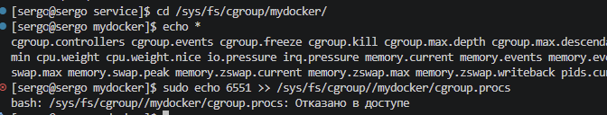

Такс, и что нам не нравится?

Юхху, оказывается если выполнить ```sudo echo "номер" >> "адрес"```, то root права на запись в файл ```>>``` уже не действуют, т.к. это следующая операция. Буду знать.

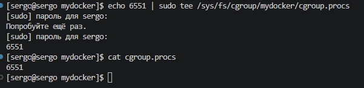

Устанавливаем лимиты на память, CPU и количество процессов. 

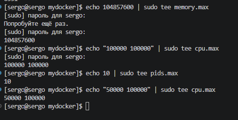

Я сначала выделил 1 ядро на группу, но в этом случае при burn не будет срабатывать тротлинг. Поэтому уменьшил до половины ядра.

Так, пробуем запустить сервис - и получаем failed. Кажется, проблема в сетевых интерфейсах.
Для этого мне нужен второй bash внутри пространства имен нашего контейнера. Для этого подойдет утилита ```nsenter```

Отлично, залезли в контейнер!

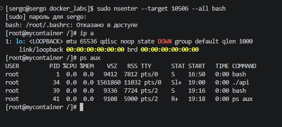

Так, локалхост по прежнему не работает. Гуглеж подсказал, что нужно включить сетевой интерфейс контейнера, делаем командой ```ip link set lo up```

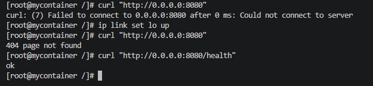

ЙООООО! Работает!


А теперь пробуем спровоцировать киллера, вжарим!

Так, я не смог выжать нужный мне лимит памяти. Почитал - у линукса есть оптимизация, которая может схлопывать участки памяти, заполненные нулями. Поэтому правлю код, чтобы он все физически забил единицами.

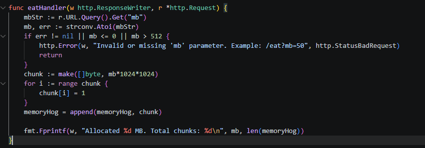

Перезапускаю сервис, заново прописываю новый PID и иду экспериментировать с лимитом на память.

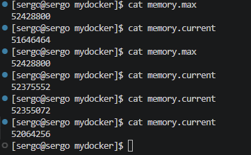

Снова укладывается в лимиты, да как так! Видимо включается механизм swap памяти (хитрец), попробую отключить его командой: ```echo 0 | sudo tee /sys/fs/cgroup/mydocker/memory.swap.max```

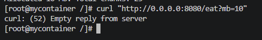

### Ураааа, уничтожен! Прикольно, что в cgroup.procs автоматом добавился PID запущенного процесса api.

Теперь пробуем увидеть тротлинг при прожарке, несколько раз запущу burn.

Чтобы посмотреть, появляется ли тротлинг ядра, смотрим статистику процессора для нашей группы. 

```cat /sys/fs/cgroup/mydocker/cpu.stat```

```bash 
usage_usec 220928336
user_usec 219825974
system_usec 1102361
nice_usec 0
core_sched.force_idle_usec 0
nr_periods 4754
nr_throttled 4396
throttled_usec 347167584
nr_bursts 0
burst_usec 0
```

Смотрим на:
- ```nr_periods 4754```- количество прошедших временных интервалов, периодов планирования. 
- ```nr_throttled 4396```- количество периодов, в которых происходило прерывание
- ```throttled_usec 347167584``` - время процесса в замороженном состоянии.

```bash
usage_usec 272330896
user_usec 271211837
system_usec 1119059
nice_usec 0
core_sched.force_idle_usec 0
nr_periods 5781
nr_throttled 5423
throttled_usec 501234795
nr_bursts 0
burst_usec 0
```
Метрика выросла, но сейчас понял, что и до того, как запустили burn, проц троттлил. Пробую увеличить лимит и перезапустить burn.

___
### Аххха, я решил продолжить лабу на следующий день, сейчас открыл консоль и понял что всё потёрлось)))

Всё восстановил. Идём дальше - лимит увеличил до полного ядра, смотрим статистику:

```bash 
usage_usec 35792
user_usec 22968
system_usec 12823
nice_usec 0
core_sched.force_idle_usec 0
nr_periods 10
nr_throttled 0
throttled_usec 0
nr_bursts 0
burst_usec 0
```

Оувоу, никакого троттлинга. Исправим это!

```bash 
usage_usec 67867300
user_usec 67825521
system_usec 41779
nice_usec 0
core_sched.force_idle_usec 0
nr_periods 690
nr_throttled 523
throttled_usec 181951850
nr_bursts 0
burst_usec 0
```

Теперь вижу, что троттлит - из 690 периодов, 523 были с прерыванием.

### Теперь пробуем запустить большое количество процессов. Нажму /burn еще 10 раз, у нас как раз лимит на 10 потоков.

Ага, интересное - процесс у нас один, это ./api: ```ps -ef```

```bash
UID          PID    PPID  C STIME TTY          TIME CMD
root           1       0  0 14:44 pts/0    00:00:00 bash
root          15       0  0 14:47 pts/2    00:00:00 bash
root         110       1 99 15:09 pts/0    00:02:59 ./api
root         129      15  0 15:10 pts/2    00:00:00 ps -ef
```


А потоков внутри у нас несколько: ```ps -T -p 110```

```bash
    PID    SPID TTY          TIME CMD
    110     110 pts/0    00:00:39 api
    110     111 pts/0    00:00:00 api
    110     112 pts/0    00:00:37 api
    110     113 pts/0    00:00:23 api
    110     114 pts/0    00:00:33 api
    110     115 pts/0    00:00:00 api
    110     118 pts/0    00:00:19 api
    110     121 pts/0    00:00:32 api
    110     122 pts/0    00:00:00 api
    110     124 pts/0    00:00:18 api
    110     126 pts/0    00:00:21 api
```

Тогда выпускаем нашу форм-бомбу ``` stress-ng --fork 15```

Так, несмотря на ограничение в ```pids.max``` в 10, у меня создалось 15 процессов. 
```bash
sergo      10382    5481  0 15:20 pts/2    00:00:00 stress-ng --fork 15
sergo      10383   10382 30 15:20 pts/2    00:00:24 stress-ng-fork
sergo      10384   10382 30 15:20 pts/2    00:00:24 stress-ng-fork
sergo      10385   10382 30 15:20 pts/2    00:00:23 stress-ng-fork
sergo      10386   10382 30 15:20 pts/2    00:00:24 stress-ng-fork
sergo      10387   10382 30 15:20 pts/2    00:00:24 stress-ng-fork
sergo      10388   10382 30 15:20 pts/2    00:00:24 stress-ng-fork
sergo      10389   10382 30 15:20 pts/2    00:00:23 stress-ng-fork
sergo      10390   10382 30 15:20 pts/2    00:00:24 stress-ng-fork
sergo      10391   10382 30 15:20 pts/2    00:00:24 stress-ng-fork
sergo      10392   10382 30 15:20 pts/2    00:00:24 stress-ng-fork
sergo      10393   10382 30 15:20 pts/2    00:00:23 stress-ng-fork
sergo      10397   10382 30 15:20 pts/2    00:00:24 stress-ng-fork
sergo      10398   10382 30 15:20 pts/2    00:00:23 stress-ng-fork
sergo      10402   10382 30 15:20 pts/2    00:00:24 stress-ng-fork
sergo      10404   10382 30 15:20 pts/2    00:00:23 stress-ng-fork
root      235465       2  0 15:21 ?        00:00:00 [kworker/10:2-events]
root      345820     540  0 15:21 ?        00:00:00 systemd-userwork: waiting...
root     1135733       2  0 15:22 ?        00:00:00 [kworker/4:0]
sergo    1159781    3547  0 15:22 pts/3    00:00:00 ps -ef
```

Понял, что т.к. я запускал вторую консоль bash, она не внеслась в группы cgroup.procs. Исправил это, запустил форк бомбу и вот что мы видим:
```bash
sergo    1868656    5481  0 15:29 pts/2    00:00:00 stress-ng --fork 15
sergo    1868657 1868656 14 15:29 pts/2    00:00:01 stress-ng-fork
sergo    1868658 1868656 14 15:29 pts/2    00:00:01 stress-ng-fork
sergo    1868659 1868656 14 15:29 pts/2    00:00:01 stress-ng-fork
sergo    1868660 1868656 14 15:29 pts/2    00:00:01 stress-ng-fork
sergo    1868661 1868656 14 15:29 pts/2    00:00:01 stress-ng-fork
sergo    1868662 1868656 14 15:29 pts/2    00:00:01 stress-ng-fork
sergo    1868663 1868656 14 15:29 pts/2    00:00:01 stress-ng-fork
```

Создано только 7 из 15 процессов. А ```cat pids.current``` показывает нам 10. 

Т.е. ограничение не дает размножиться процессам и наша форк бомба остановлена.

### Ура, переходим к шагу 4.

## Step 4: Раздаем права

У нас есть несколько опций, как регулировать права. 
- непосредственно capabilities, это порядка 40 отдельных прав. 
- seccomp, фильтр системных вызовов
- LSM, модули безопасности Linux. Это отдельный набор правил, централизованно заданный администратором на всю систему

Пока чистал инфу,, натолкнулся на изоляцию файловой системыю. В лабе это не указано, но мне интересно просто потыкать, что такое chroot.

Вбиваю в консоль внутри контейнера: ```ls -la /```

```bash
итого 524360
dr-xr-xr-x  18 nobody nobody      4096 сен 14 21:36 .
dr-xr-xr-x  18 nobody nobody      4096 сен 14 21:36 ..
lrwxrwxrwx   1 nobody nobody         7 окт 12  2025 bin -> usr/bin
drwxr-xr-x   2 nobody nobody      4096 сен 17 22:41 boot
drwxr-xr-x  20 nobody nobody      4080 сен 23 11:05 dev
drwxr-x---   5 nobody nobody      4096 янв  1  1970 efi
drwxr-xr-x  90 nobody nobody     12288 сен 23 15:16 etc
drwxr-xr-x   3 nobody nobody      4096 сен 14 21:34 home
lrwxrwxrwx   1 nobody nobody         7 окт 12  2025 lib -> usr/lib
lrwxrwxrwx   1 nobody nobody         7 окт 12  2025 lib64 -> usr/lib
drwx------   2 nobody nobody     16384 сен 14 21:29 lost+found
drwxr-xr-x   2 nobody nobody      4096 окт 12  2025 mnt
drwxr-xr-x   2 nobody nobody      4096 окт 12  2025 opt
dr-xr-xr-x 383 nobody nobody         0 сен 23 14:44 proc
drwxr-x---   4 nobody nobody      4096 сен 14 21:36 root
drwxr-xr-x  33 nobody nobody       740 сен 23 11:05 run
lrwxrwxrwx   1 nobody nobody         7 окт 12  2025 sbin -> usr/bin
drwxr-xr-x   4 nobody nobody      4096 сен 14 21:33 srv
-rw-------   1 nobody nobody 536870912 сен 14 21:36 swapfile
dr-xr-xr-x  13 nobody nobody         0 сен 23 11:05 sys
drwxrwxrwt  14 nobody nobody       460 сен 23 11:45 tmp
drwxr-xr-x   9 nobody nobody      4096 сен 23 15:16 usr
drwxr-xr-x  13 nobody nobody      4096 сен 23 11:05 var
```

Получается, сейчас наш контейнер имеет доступ ко всей фаайловой системе хоста. А если вспомнить, что в Linux "Всё есть файл", то даже если ограничение прав не даст из нашего контейнера изменить эти файлы, то прочитать их и намусорить в папках он сможет. 

Поэтому создам папку для файловой системы контейнера: ```mkdir rootmydocker```

Установлю туда Alpine (как это делает и Docker). Внутри не будет ядра и GRUB, это минимальная файловая система. 

Команда ```wget https://dl-cdn.alpinelinux.org/alpine/v3.20/releases/x86_64/alpine-minirootfs-3.20.3-x86_64.tar.gz
tar -xzf alpine-minirootfs-*.tar.gz```

И сменяем наш корень файловой системы внутри контейнера: ```chroot ~/myrootfs /bin/sh```

Воу, а мой api то не запускается! Помощник мне подсказывает, что бинарник скорее всего собран под Arch Linux. А у Alpine совсем другая библиотека, поэтому нужно пересобрать бинарник, сделать его статически слинкованным. 

```CGO_ENABLED=0 go build -o api_static ```

Ура, всё запускается!

Смотрим теперь корень нашей файловой системы: ```/bin/ls -la /```.

```sh
total 76
drwxr-xr-x   19 root     root          4096 Sep 23 15:47 .
drwxr-xr-x   19 root     root          4096 Sep 23 15:47 ..
drwxr-xr-x    2 root     root          4096 Sep  6  2024 bin
drwxr-xr-x    2 root     root          4096 Sep  6  2024 dev
drwxr-xr-x   17 root     root          4096 Sep  6  2024 etc
drwxr-xr-x    2 root     root          4096 Sep 23 16:02 home
drwxr-xr-x    6 root     root          4096 Sep  6  2024 lib
drwxr-xr-x    5 root     root          4096 Sep  6  2024 media
drwxr-xr-x    2 root     root          4096 Sep  6  2024 mnt
drwxr-xr-x    2 root     root          4096 Sep  6  2024 opt
dr-xr-xr-x    2 root     root          4096 Sep  6  2024 proc
drwx------    2 root     root          4096 Sep 23 15:54 root
drwxr-xr-x    2 root     root          4096 Sep  6  2024 run
drwxr-xr-x    2 root     root          4096 Sep  6  2024 sbin
drwxr-xr-x    2 root     root          4096 Sep  6  2024 srv
drwxr-xr-x    2 root     root          4096 Sep  6  2024 sys
drwxr-xr-x    2 root     root          4096 Sep  6  2024 tmp
drwxr-xr-x    7 root     root          4096 Sep  6  2024 usr
drwxr-xr-x   12 root     root          4096 Sep  6  2024 var
```

Отлично, это папки, внутри папки rootmydocker, и контейнер думает, что это корень файловой системы.

### Теперь приступим к capabilities

Посмотрим, какие права у меня есть у контейнера, в bash на хосте, для этого смотрим proc/<PID моего процесса>

```grep Cap /proc/4965/status```

```bash
CapInh: 0000000000000000
CapPrm: 000001ffffffffff
CapEff: 000001ffffffffff
CapBnd: 000001ffffffffff
CapAmb: 0000000000000000
```

Теперь это надо декодировать:
```capsh --decode=000001ffffffffff```
```bash
0x000001ffffffffff=cap_chown,cap_dac_override,cap_dac_read_search,cap_fowner,cap_fsetid,cap_kill,cap_setgid,cap_setuid,cap_setpcap,cap_linux_immutable,cap_net_bind_service,cap_net_broadcast,cap_net_admin,cap_net_raw,cap_ipc_lock,cap_ipc_owner,cap_sys_module,cap_sys_rawio,cap_sys_chroot,cap_sys_ptrace,cap_sys_pacct,cap_sys_admin,cap_sys_boot,cap_sys_nice,cap_sys_resource,cap_sys_time,cap_sys_tty_config,cap_mknod,cap_lease,cap_audit_write,cap_audit_control,cap_setfcap,cap_mac_override,cap_mac_admin,cap_syslog,cap_wake_alarm,cap_block_suspend,cap_audit_read,cap_perfmon,cap_bpf,cap_checkpoint_restore
```
И мы видим, что у нас доступны ВСЕ права!

Идём внутрь контейнера и пробуем изменить время:
```date -s "12:34:56"```
```bash
date: невозможно установить дату: Операция не позволена
Ср 23 сен 2026 12:34:56 MSK
[root@mycontainer /]#  date
Ср 23 сен 2026 19:40:13 MSK
```

Ага, меня бьют по рукам. Причем, права то на бумаге есть, но из-за того, что запускали контейнер с пространством пользователя -user, линукс считает нас за обычного юзера. 

Пробуем изменить время за обычного юзера: 
```bash
date -s "18:00:00"
date: невозможно установить дату: Операция не позволена
```

Попробовал запустить контейнер от root пользователя, всё равно не получается.

Нашел, что возможно время сразу правится из-за синхронизации времени. Отключил пока эту утилиту.
```bash 
sudo timedatectl set-ntp false
```

Ееее, победа! После долгих поисков, я решил запустить контейнер без --user. В этом случае root внутри контейнера будет root и снаружи. И действительно, права все работают и время я смог изменить!
```bash
[sergo@sergo docker_labs]$ sudo unshare --pid --net --mount --uts --ipc --fork --mount-proc bash
[sudo] пароль для sergo: 
[root@sergo docker_labs]# ps -ef
UID          PID    PPID  C STIME TTY          TIME CMD
root           1       0  0 14:18 pts/2    00:00:00 bash
root           2       1  0 14:18 pts/2    00:00:00 ps -ef
[root@sergo docker_labs]# date -s "12:34:56"
Чт 24 сен 2026 12:34:56 MSK
[root@sergo docker_labs]# date
Чт 24 сен 2026 12:34:59 MSK
```

Теперь пробуем убрать право изменять время. 

Для этого запущу новый контейнер, но с дропом ```cap_sys_time```

```bash
sudo unshare --pid --net --mount --uts --ipc --fork --mount-proc \capsh --drop=cap_sys_time -- -c "bash"
```

Узнал про утилиту ```capsh --print```, смотрим что по правам:
```
Current: =ep cap_sys_time-ep
Bounding set =cap_chown,cap_dac_override,cap_dac_read_search,cap_fowner,cap_fsetid,cap_kill,cap_setgid,cap_setuid,cap_setpcap,cap_linux_immutable,cap_net_bind_service,cap_net_broadcast,cap_net_admin,cap_net_raw,cap_ipc_lock,cap_ipc_owner,cap_sys_module,cap_sys_rawio,cap_sys_chroot,cap_sys_ptrace,cap_sys_pacct,cap_sys_admin,cap_sys_boot,cap_sys_nice,cap_sys_resource,cap_sys_tty_config,cap_mknod,cap_lease,cap_audit_write,cap_audit_control,cap_setfcap,cap_mac_override,cap_mac_admin,cap_syslog,cap_wake_alarm,cap_block_suspend,cap_audit_read,cap_perfmon,cap_bpf,cap_checkpoint_restore
Ambient set =
Current IAB: !cap_sys_time
Securebits: 00/0x0/1'b0 (no-new-privs=0)
 secure-noroot: no (unlocked)
 secure-no-suid-fixup: no (unlocked)
 secure-keep-caps: no (unlocked)
 secure-no-ambient-raise: no (unlocked)
uid=0(root) euid=0(root)
gid=0(root)
groups=0(root)
Guessed mode: HYBRID (4)
```

Отлично, стоит ограничение на изменение времени. Пробую снова такую же команду, как в прошлый раз:
```bash
[root@sergo docker_labs]# date -s "12:34:56"
date: невозможно установить дату: Операция не позволена
Чт 24 сен 2026 12:34:56 MSK
[root@sergo docker_labs]# date
Чт 24 сен 2026 14:33:22 MSK
```

Супер, изменить системное время не смог - ограничение работает. 

### Но в случае, если мы задаем флаг ```--user``` при создании контейнера, то у нас уже проблема прав решается и процесс не имеет доступа к root правам хоста. 

### Наконец, seccomp-профиль!

Этот механизм помогает изолировать процессы, блокируя системные вызовы, которые могут быть использованы для эксплуатации уязвимостей.

В основе работы seccomp три составляющих: фильтрация системных вызовов, режим работы и профили seccomp. При этом Seccomp действует как фильтр между приложением и ядром, проверяя каждый системный вызов, который пытается выполнить процесс. Если системный вызов не разрешен, он блокируется, предотвращая выполнение небезопасных операций и минимизируя риски для системы

Чтобы потестировать запрет системного вызова, выберу вызов ```clock_nanosleep```, который ставит на паузу процесс. А команда ```sleep``` дёргает именно его. 

Напишу небольшой скрипт на bash, чтобы проверять этот вызов:

```bash
echo "Ждем 2 секунды"
sleep 2
echo "Ждём 5 секунд"
sleep 5
echo "Готово"
```

Запущу его - все отрабатывает с паузами. 

Так как unshare не умеет работать с seccomp (ведь seccomp нужно назначить ДО запуска процесса, а для создания нового namespace unshare использует большой пул системных вызовов), поэтому мне понадобится обёртка в виде systemd-run.

Но при этом нельзя запрещать системные вызовы, знаю про unshare, mount, clone - они точно 

```bash
systemd-run --user --pty \
  -p SystemCallFilter=~clock_nanosleep \
  -- unshare --pid --net --mount --uts --ipc --user --map-root-user --fork --mount-proc bash
```

### systemd-run запускает процессы как временные сервисы. 
- флаг ```--user``` запустит этот процесс от моего юзера, а не от root
- флаг ```--pty``` подключает нас к вызываемому терминалу
- ```-p SystemCallFilter``` это запрещающий фильтр на системный вызов паузы

Запускаем наш скрипт выше и получаем ответ:

```bash
[root@sergo lab_1]# bash seccomp.sh 
Ждем 2 секунды
seccomp.sh: строка 2:     8 Неверный системный вызов                   (образ памяти сброшен на диск) sleep 2
Ждём 5 секунд
seccomp.sh: строка 4:     9 Неверный системный вызов                   (образ памяти сброшен на диск) sleep 5
Готово
```

### Вижу, что наше ограничение на вызов паузы работает и киллер моментально реагирует. А если я запускаю этот же скрипт на хосте, то все работает с паузами и без ошибок. Ура!

## Step 5: Рейнджеры, собраться!

Собираю все мои артефакты выше в один скрипт. Вернусь сюда уже с результатами выполнения скрипта.

```bash
unshare --pid --net --mount --uts --ipc --user --map-root-user --fork --mount-proc sleep infinity & MYDOCKER_PID=$!
sudo nsenter --target "$MYDOCKER_PID" --uts --net bash -c 'hostname mycontainer && ip link set lo up'

CGROUP_API="/sys/fs/cgroup/mydocker"
sudo mkdir -v "$CGROUP_API"

echo "$MYDOCKER_PID" | sudo tee "$CGROUP_API"/cgroup.procs

echo 20M | sudo tee "$CGROUP_API"/memory.max
echo "90000 100000" | sudo tee "$CGROUP_API"/cpu.max
echo 15 | sudo tee "$CGROUP_API"/pids.max

echo 0 | sudo tee "$CGROUP_API"/memory.swap.max

sudo nsenter --target "$MYDOCKER_PID" --all /home/sergo/docker_labs/itmo-devops-labs/lab_1/service/api
```

Запущено и работает! Дергаем за ручку ```/health``` ииииии....

```bash
[sergo@sergo docker_labs]$ sudo nsenter --target 2964769 --net curl http://0.0.0.0:8080/health
ok
```

### ОМАГАД, РАБОТАЕТ!!

Теперь запускаю докер-контейнер:
```bash
sudo docker run -d \
--name test \
--memory=20m \
--cpus=0.9 \
--pids-limit=15 \   
-p 8080:8080 \
-v /home/sergo/docker_labs/itmo-devops-labs/lab_1/service/api_static:/app/api  \
alpine  \ 
/app/api  \
```
Флагами тут я задаю наши лимиты в cgroup, прокидываю локальный порт на хост, ставлю точку монтирования и делаю контейнер на основе alpine. 

/health отдаёт ок, приложение работает, отлично.

### Так, теперь сравним самостоятельное создание контейнера с тем, что делает Docker.
- **Namespaces**

    В обоих случаях мы изолируем пространства имён.
- **Cgroup**

    В обоих случаях ограничения поребления ресурсов делается через запись  в cgroup.
- Изоляция файловой системы

    При самостоятельном создании контейнера я использовал chroot, чтобы создать отдельную файловую систему. В скрипт этот шаг не вошёл, поэтому там наш процесс находится в домашней директории хоста. 

    Docker же всегда монтирует для контейнера отдельную корневую файловую систему. 

- **Capabilities**

    При самостоятельном создании контейнера нужно ручками сбрасывать лишние права. 
    
    Но если мы используем флаг ```--user```, то пространство имен изменяется и внутри контейнера наш root - простой юзер на хосте. И сколько не выставляй разрешающие права, обойти это правило не получится. 

    Docker тоже сбрасывает лишние capabilities для нового контейнера.  
- **Seccomp**

    При стандартном создании контейнера, нужно вручную выставлять ограничения в Seccomp. 

    В то же время Docker по умолчанию блокирует самые опысные системные вызовы.

#### А вот что Docker делает дополнительно:

- Создает фонового демона контейнера, который посволяет собирать логи, перезапускать контейнер, управлять томами

- Создает по умолчанию сеть: настраивает виртуальные интерфейсы на хосте и в контейнере, подключает их к мосту, настраивает фаервол для проброса портов.

- Использует слоистые файловые системы, что позволяет переиспользовать ресурсы и экономить место.

- Встроенная дистрибуция образов

## Step 6: Добавляем образ

Напишем обычный докерфайл:

```bash
FROM golang:1.22
WORKDIR /app
COPY ./service/ .
RUN go build -o api ./main.go
CMD ["/app/api"]
```

И соберем контейнер командой:
```bash
sudo docker build -t api-single .
```

Смотрим ответ:
```bash
DEPRECATED: The legacy builder is deprecated and will be removed in a future release.
            Install the buildx component to build images with BuildKit:
            https://docs.docker.com/go/buildx/

Sending build context to Docker daemon  54.59MB
Step 1/5 : FROM golang:1.27.1
1.27.1: Pulling from library/golang
Digest: sha256:e0174e51e81218523251d85d248a90d24c3d5e81543b4f07a5d66229397db190
Status: Downloaded newer image for golang:1.27.1
 ---> e0174e51e812
Step 2/5 : WORKDIR /app
 ---> Running in aed4074b4715
 ---> Removed intermediate container aed4074b4715
 ---> a84de7bf6d88
Step 3/5 : COPY ./service/ .
 ---> 4ab0356a87fa
Step 4/5 : RUN go build -o api ./main.go
 ---> Running in 19535b6c8247
 ---> Removed intermediate container 19535b6c8247
 ---> e44fa4a317c3
Step 5/5 : CMD ["/app/api"]
 ---> Running in 6f6bcc86b1ac
 ---> Removed intermediate container 6f6bcc86b1ac
 ---> 934a43bb6d0e
Successfully built 934a43bb6d0e
Successfully tagged api-single:latest
```

Теперь напишем мультистейдж докерфайл:
```bash
FROM golang:1.22 AS builder
WORKDIR /app
COPY ./service/ .
RUN CGO_ENABLED=0 GOOS=linux go build -o api ./main.go


FROM scratch
COPY --from=builder /app/api /api
CMD ["/api"]
```

Он качает все зависимости и собирает наш бинарник, но в контейнер дальше передает только слой с уже собранным бинарником.

Соберем мультистейдж образ:
```bash
sudo docker build -f Dockerfile.multi -t api-multi .
```

Ответ:
```bash
DEPRECATED: The legacy builder is deprecated and will be removed in a future release.
            Install the buildx component to build images with BuildKit:
            https://docs.docker.com/go/buildx/

Sending build context to Docker daemon   54.6MB
Step 1/7 : FROM golang:1.27.1 AS builder
 ---> e0174e51e812
Step 2/7 : WORKDIR /app
 ---> Using cache
 ---> a84de7bf6d88
Step 3/7 : COPY ./service/ .
 ---> Using cache
 ---> 4ab0356a87fa
Step 4/7 : RUN CGO_ENABLED=0 GOOS=linux go build -o api ./main.go
 ---> Running in c9af878dfd5c
 ---> Removed intermediate container c9af878dfd5c
 ---> 99f6ce55eade
Step 5/7 : FROM scratch
 ---> 
Step 6/7 : COPY --from=builder /app/api /api
 ---> f63a54c7630d
Step 7/7 : CMD ["/api"]
 ---> Running in 33617a8ba2b0
 ---> Removed intermediate container 33617a8ba2b0
 ---> a3eddf025143
Successfully built a3eddf025143
Successfully tagged api-multi:latest
```

#### Теперь самое интересное - а сколько ресурсов занимает каждый образ?

Image аж в 72 раза меньше занимает:
```bash
sudo docker image ls

IMAGE               ID             DISK USAGE   CONTENT SIZE   EXTRA
api-multi:latest    a3eddf025143       13.6MB         4.96MB        
api-single:latest   934a43bb6d0e       1.47GB          360MB 

```

А слоёв ожидаемо 15шт в single против 2 слоев в multi:
```bash
sudo docker history api-single:latest

IMAGE          CREATED          CREATED BY                                      SIZE      COMMENT
934a43bb6d0e   14 minutes ago   /bin/sh -c #(nop)  CMD ["/app/api"]             0B        
e44fa4a317c3   14 minutes ago   /bin/sh -c go build -o api ./main.go            101MB     
4ab0356a87fa   14 minutes ago   /bin/sh -c #(nop) COPY dir:a3e78e12b11b73ddf…   26.6MB    
a84de7bf6d88   14 minutes ago   /bin/sh -c #(nop) WORKDIR /app                  8.19kB    
e0174e51e812   2 weeks ago      WORKDIR /go                                     4.1kB     buildkit.dockerfile.v0
<missing>      2 weeks ago      RUN /bin/sh -c mkdir -p "$GOPATH/src" $GOPA…    16.4kB    buildkit.dockerfile.v0
<missing>      2 weeks ago      COPY /target/ / # buildkit                      296MB     buildkit.dockerfile.v0
<missing>      2 weeks ago      ENV PATH=/go/bin:/usr/local/go/bin:/usr/loca…   0B        buildkit.dockerfile.v0
<missing>      2 weeks ago      ENV GOPATH=/go                                  0B        buildkit.dockerfile.v0
<missing>      2 weeks ago      ENV GOTOOLCHAIN=local                           0B        buildkit.dockerfile.v0
<missing>      2 weeks ago      ENV GOLANG_VERSION=1.27.1                       0B        buildkit.dockerfile.v0
<missing>      2 weeks ago      RUN /bin/sh -c set -eux;  apt-get update;  a…   287MB     buildkit.dockerfile.v0
<missing>      2 weeks ago      RUN /bin/sh -c set -eux;  apt-get update;  a…   202MB     buildkit.dockerfile.v0
<missing>      2 weeks ago      RUN /bin/sh -c set -eux;  apt-get update;  a…   65MB      buildkit.dockerfile.v0
<missing>      2 weeks ago      # debian.sh --arch 'amd64' out/ 'trixie' '@1…   134MB     debuerreotype 0.17

sudo docker history api-multi:latest
IMAGE          CREATED         CREATED BY                                      SIZE      COMMENT
a3eddf025143   5 minutes ago   /bin/sh -c #(nop)  CMD ["/api"]                 0B        
f63a54c7630d   5 minutes ago   /bin/sh -c #(nop) COPY file:a3a5137567e477d7…   8.61MB    

```

А теперь сравним кэширование. 

Попробую заново выполнить сборку, но ничего не меняя в файлах:
```bash
Sending build context to Docker daemon   54.6MB
Step 1/7 : FROM golang:1.27.1 AS builder
 ---> e0174e51e812
Step 2/7 : WORKDIR /app
 ---> Using cache
 ---> a84de7bf6d88
Step 3/7 : COPY ./service/ .
 ---> Using cache
 ---> 4ab0356a87fa
Step 4/7 : RUN CGO_ENABLED=0 GOOS=linux go build -o api ./main.go
 ---> Using cache
 ---> 99f6ce55eade
Step 5/7 : FROM scratch
 ---> 
Step 6/7 : COPY --from=builder /app/api /api
 ---> Using cache
 ---> f63a54c7630d
Step 7/7 : CMD ["/api"]
 ---> Using cache
 ---> a3eddf025143
Successfully built a3eddf025143
Successfully tagged api-multi:latest
```

Вижу, что ничего не компилировалось - все слои взяты из кэша.

А теперь в исходый файл добавлю комментарий - чтобы хэш файла изменился. И перезапущу сборку.

```bash
Sending build context to Docker daemon   54.6MB
Step 1/7 : FROM golang:1.27.1 AS builder
 ---> e0174e51e812
Step 2/7 : WORKDIR /app
 ---> Using cache
 ---> a84de7bf6d88
Step 3/7 : COPY ./service/ .
 ---> 3897bce59faf
Step 4/7 : RUN CGO_ENABLED=0 GOOS=linux go build -o api ./main.go
 ---> Running in 8e79ff83b7f9
 ---> Removed intermediate container 8e79ff83b7f9
 ---> 5e12322c8da2
Step 5/7 : FROM scratch
 ---> 
Step 6/7 : COPY --from=builder /app/api /api
 ---> b39f9ea3b145
Step 7/7 : CMD ["/api"]
 ---> Running in 63f2fe40d508
 ---> Removed intermediate container 63f2fe40d508
 ---> fbe81274fa45
Successfully built fbe81274fa45
Successfully tagged api-multi:latest
```

Видим, что почти все слои компилировались заново, т.к. наш хэш изменился из-за изменений в main.go.

### Теперь проверим фокусы с исчезновением файлов в контейнере. 

Создам копию мультистейдж докерфайла, заменив scratch на alpine  в контейнере, чтобы у меня появилась возможность создать внутри файлы.

Кстати, образ с alpine тяжелеее scratch всего в 2 раза:
```bash
IMAGE                     ID             DISK USAGE   CONTENT SIZE   EXTRA     
api-multi-alpine:latest   aa1914c6dbe5       26.5MB         8.81MB        
api-multi:latest          fbe81274fa45       13.6MB         4.96MB 
```

Итак, запускаем контейнер, создаем внутри файл. Удаляю и перезапускаю контейнер и проверяю наличие моего файла:

```bash
sudo docker run -d --name test-create-file api-multi-alpine
sudo docker exec -it test-create-file sh

touch /hello.txt

ls /
api        bin        dev        etc        hello.txt  home       lib        media      mnt        opt        proc       root       run        sbin       srv        sys        tmp        usr        var

exit
sudo docker rm -f test-create-file

sudo docker run -d --name test-create-file api-multi-alpine
sudo docker exec -it test-create-file sh

ls /
api    bin    dev    etc    home   lib    media  mnt    opt    proc   root   run    sbin   srv    sys    tmp    usr    var
```
Вижу, что после перезапуска контейнера наш файлик пропал, отлично!

Теперь пробуем примонтировать внешний топ, создать там файл из контейнера и перезапустить контейнер.

```bash
sudo docker run -d --name test-create-file-volume -v /tmp/mydata:/mydata api-multi-alpine
sudo docker exec -it test-create-file-volume sh

touch /mydata/hello.txt

ls /mydata
hello.txt

exit
sudo docker rm -f test-create-file-volume

sudo docker run -d --name test-create-file-volume -v /tmp/mydata:/mydata api-multi-alpine
sudo docker exec -it test-create-file-volume sh

ls /mydata
hello.txt
```

Ура, мы перезапустили контейнер - а файл на месте! Эксперимент завершен удачно!

## Step 7: Пробуем ещё больше ИЗОЛЯЦИИ!

Так, gVisor у меня не установлен - поэтому первым делом ставлю его.

```bash
yay -S gvisor-bin
```

Вообще, что такое gVisor и чем он полезен?

```text
Он создаёт промежуточный слой изоляции между контейнеризированным приложением и ядром хост-системы. 

Его ключевая идея — реализовать в пользовательском пространстве (userspace) собственное миниатюрное «ядро», которое перехватывает системные вызовы приложения и обрабатывает их самостоятельно, не передавая напрямую ядру хоста. Это значительно сокращает поверхность атаки на ядро хоста.
```

Т.е. фактически gVisor - что-то среднее между виртуальной машиной и фильтром системных вызовов.

Сразу тут можно упомянуть вопрос: ```что у обычного контейнера остаётся общим с хостом в любом случае и почему это предел контейнерной изоляции? ```

У всех контейнеров с хостом остается общее ядро Linux. Через инструменты, которые мы рассматривали выше, мы можем ограничить доступ процесса к ресурсам ядра, но контейнеры по прежнему не являются виртуалками. 

Поэтому gVisor тут может усилить изоляцию, выступая посредником между контейнером и ядром. Он перехватывает системные вызовы, пропуская через свое ядро, прежде чем они выполнятся на ядре линукса.

Попробую запустить контейнер с gVisor. Для этого, судя по иструкции с оф портала gVisor, нужно внести изменения в daemon.json докера.

```json
{
  "runtimes": {
    "runsc": {
      "path": "/usr/bin/runsc"
    }
  }
}
```

И перезапускаем демона командой ```sudo systemctl restart docker```

```bash
sudo docker run --runtime=runsc -d --name gvisor-test api-multi
```

Отлично, контейнер запустился на gVisor!

## Step 8: ФИНАЛ, трогаем чуть-чуть мониторинг
