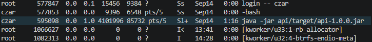

# The most ✨*aesthetic*✨ containerization and orchestration lab 1 report

## Часть 0
> Пишем тестовый http сервис с тремя ендпоинтами`  

Тестовый сервис Java API (Java 21)


Сборка и запуск:

```bash
mvn package
java -jar target/api-1.0.0.jar
```

Сервис запускается на порту 8080

Ендпоинты:

```shell
curl localhost:8080/health
curl 'localhost:8080/eat?mb=100'
curl localhost:8080/burn
```

`/eat` увеличивает RSS на указанное число мегабайт и удерживает память до конца выполнения программы.  
`/burn` загружает ядро на 100% и не завершает HTTP запрос. 

## Часть 1
> Просто запускаем сервис и смотрим, что все работает + находим PID процесса.

Оно работает (клянусь):  




PID: 595098

## Часть 2
> Изолируем наш процесс по namespaces и проверяем, что все работает как надо

Сначала посмотрим к каким неймспейсам есть доступ у сервиса изначально. Используем `ls` чтобы просмотреть содержимое /proc/<pid нашего процесса>/ns. В /proc лежат все процессы в виде директорий, названных по pid, в ns - соответственно доступные неймспейсы.
```bash
ls -l /proc/595098/ns/
```  
Вывод:
```bash
total 0
lrwxrwxrwx 1 czar czar 0 Sep 15 16:59 cgroup -> 'cgroup:[4026531835]'
lrwxrwxrwx 1 czar czar 0 Sep 15 16:59 ipc -> 'ipc:[4026531839]'
lrwxrwxrwx 1 czar czar 0 Sep 14 15:13 mnt -> 'mnt:[4026531832]'
lrwxrwxrwx 1 czar czar 0 Sep 15 16:59 net -> 'net:[4026531833]'
lrwxrwxrwx 1 czar czar 0 Sep 15 16:59 pid -> 'pid:[4026531836]'
lrwxrwxrwx 1 czar czar 0 Sep 15 16:59 pid_for_children -> 'pid:[4026531836]'
lrwxrwxrwx 1 czar czar 0 Sep 15 16:59 time -> 'time:[4026531834]'
lrwxrwxrwx 1 czar czar 0 Sep 15 16:59 time_for_children -> 'time:[4026531834]'
lrwxrwxrwx 1 czar czar 0 Sep 15 16:59 user -> 'user:[4026531837]'
lrwxrwxrwx 1 czar czar 0 Sep 15 16:59 uts -> 'uts:[4026531838]'
```
Как видим, все доступные ✨*namespaces*✨ принадлежат хосту (czar). Нас такой расклад не очень устраивает, поэтому работаем по заданию и наводим твердый порядок (изолируем процесс по неймспейсам) жесткой рукой (`unshare`).  
По заданию нам нужны следующие неймспейсы: pid, mount, net, uts, ipc и user.  

К сожалению прочитать `unshare --help` и просто выполнить `unshare -pmnuiU <сервис>` не прокатило и пришлось думать мозгом(  

Итоговая команда выглядит так:
```bash
unshare -Urmpniu --fork --mount-proc java -jar lab1/api/target/api-1.0.0.jar 
```
**Теперь подробно про флаги:**  
Первая группа `-Urmpniu` указывает какие неймспейсы мы хотим создать для нового процесса.
- U — Создаем новый user namespace - изолируем процесс от пользователей хоста и их групп
- r — Относится к флагу `U`, он же --map-root-user. Нужен для того, чтобы смапить текущего пользователя хоста в root внутри процесса (UID 0).
- m — Создаем новый mount namespace - изолируем ✨*таблицу монтирования*✨ ФС процесса.
- p — Создаем новый PID процесса, ему присваивается значение PID 1.
- n — Аналогично создаем новый network namespace, изолируем процесс от всего сетевого стека хоста (таблицы маршрутизации, айпишники, сетевые интерфейсы, всякие настройки фаервола и т.д.)
- i — Создаем IPC namespace. То есть Inter-Process Communication. То есть изолируем межпроцессное взаимодействие. То есть всякие shared memory, семафоры и т.д.
- u — Создаем новый UTS namespace. Изолируем hostname и другие идентификаторы, благодаря чему можем назвать наш "контейнер" ***new-ultimate-innovative-russian-container-better-than-docker-better-than-any-decadent-west-app-called-rucker***.  

Этот аргумент кстати можно разбить на отдельные легкочитаемые флаги `-U -r -m -p -n -i -u`, нооо.... пожалуй нет.  
Идем далее:
- --fork — Нужен, чтобы запустить джарник как дочерний процесс unshare с PID 1. То есть получается, что у нас изначально есть процесс (условный `shell`) на хосте, который запускает новый процесс `unshare`, который создает еще один процесс внутри себя через форк. И ВИШЕНКОЙ НА ТОРТЕ ЯВЛЯЕТСЯ ТО, ЧТО В КАЧЕСТВЕ ДОЧЕРНЕГО ПРИМЕРА У НАС ЗАПУСКАЕТСЯ **ВИРТУАЛЬНАЯ МАШИНА** ДЖАВЫ... ох... ну то есть... виртуалка в "контейнере" типа... ох...
- --mount-proc — Монтируем новый экзмепляр procfs в /proc, чтобы внутри "контейнера" shell имел доступ только к внутренним процессам и такие команды как top и ps выводили корректные списки.

#### Проверки:
Для начала в другом терминале выполним `ps -ef | grep '[a]pi-1.0.0.jar'`, чтобы узнать PID нашего процесса в PID namespace хоста.  
Получаем:
```bash
czar     2476527 2273751  0 01:12 pts/10   00:00:00 unshare -Urmpniu --fork --mount-proc java -jar lab1/api/target/api-1.0.0.jar
czar     2476528 2476527  0 01:12 pts/10   00:00:00 java -jar lab1/api/target/api-1.0.0.jar
```
Нас интересует процесс с PID **2476528**.

1) > изнутри процесс — PID 1, чужих процессов не видит;
    
    Для доказательства PID = 1 используем команду
    ```bash
    sudo nsenter -t 2476528 -p -m ps -ef
    ```
    `nsenter` — утилита, позволяющая зайти внутрь процесса (точнее внутрь изолированного namespaces) и выполнить там команду. Можно было как-то иначе сделать, но так на мой взгляд проще всего + очень наглядно.  
    Флаги: 
    - t — (target) указываем PID в пространстве имен хоста
    - p — (pid) входим в PID namespaces процесса target
    - m — (mount) входим в mount namespaces процесса target, чтобы получить доступ к изолированной ФС и в частности к /proc
    - ps -ef — Собственно команда, которую выполняем внутри. В данном случаем смотри все процессы
    
    Вывод:
    ```bash
    UID          PID    PPID  C STIME TTY          TIME CMD
    czar           1       0  0 01:12 pts/10   00:00:01 java -jar lab1/api/target/api-1.0.0.jar
    root          59       0  0 01:33 pts/7    00:00:00 ps -ef
    ```

    Видим ТОЛЬКО процесс java -jar с PID 1 *ну и ps, но это из-за того, что она выполняется в том же контексте*.

2) > у него своё имя хоста и своя пустая сеть;
    
    Для данной проверки снова используем nsenter и проверим имя хоста.
    ```bash
    sudo nsenter -t 2476528 -u hostname
    ```
    Вывод:
    ```bash
    svinoserver
    ```
    Имя внутри процесса совпадает с именем хоста, но это из-за того, что при использовании unshare мы не указывали другое имя :(  
    НООО, можно поменять имя сейчас и посмореть, что на хосте оно не изменится.  
    Команды и вывод:
    ```bash
    [czar@svinoserver ~]$ sudo nsenter -t 2476528 -u hostname new-ultimate-innovative-russian-container-better-than-docker
    [czar@svinoserver ~]$ sudo nsenter -t 2476528 -u hostname
    new-ultimate-innovative-russian-container-better-than-docker
    [czar@svinoserver ~]$ hostname
    svinoserver
    ```
    **Во-первых**, название ***new-ultimate-innovative-russian-container-better-than-docker-better-than-any-decadent-west-app-called-rucker*** является *invalid argument*, так как слишком крутое (лимит по кол-ву символов)  
    **Во-вторых**, как видим название хоста не изменилось.

    Теперь по сетевой изоляции:  
    Снова импользуем nsenter и видим в выводе всего один локальный интерфейс.
    ```bash
    sudo nsenter -t 2476528 -n ip a
    1: lo: <LOOPBACK> mtu 65536 qdisc noop state DOWN group default qlen 1000
    link/loopback 00:00:00:00:00:00 brd 00:00:00:00:00:00
    ```
    В то же время на хосте `ip a` показывает 12 интерфейсов.   
    Могу вот вам интерфейс докера показать, но он спит, просьба не будить.
    ```bash
    [czar@svinoserver ~]$ ip a
    
    ...
    
    6: docker0: <NO-CARRIER,BROADCAST,MULTICAST,UP> mtu 1500 qdisc noqueue state DOWN group default
    link/ether d6:31:59:71:61:45 brd ff:ff:ff:ff:ff:ff
    inet 172.17.0.1/16 brd 172.17.255.255 scope global docker0
       valid_lft forever preferred_lft forever
    ```


3) > root внутри — это непривилегированный пользователь снаружи (проверь, под каким uid процесс виден на хосте).
    
    Снова смотрим `sudo nsenter -t 2476528 -p -m ps -ef`:
    ```bash
    UID          PID    PPID  C STIME TTY          TIME CMD
    czar           1       0  0 01:12 pts/10   00:00:05 java -jar lab1/api/target/api-1.0.0.jar
    ```
    Еще посмотрим `cat /proc/2476528/uid_map`:
    ```bash
             0       1000          1
    ```
    0 — UID внутри "контейнера", 1000 — UID на хосте.  
    Теперь посмотрим UID процесса с хоста:
    ``` bash
    ps -o ruid,user,pid,cmd -p 2476528
    ```
    Вывод:
    ```bash
    RUID USER         PID CMD
    1000 czar     2476528 java -jar lab1/api/target/api-1.0.0.jar
    ```
    Видим, что процесс выполняется под 1000, а не под 0, то есть под НЕпривелигированным пользователем.

## Часть 3
> Заведи для процесса cgroup v2 и навесь лимиты. Проверь каждый через свой сервис:

*Какой-то объемный отчет выходит, дальше постараюсь писать покороче (не обещаю)*.

Для начала создадим cgroup для нашего крутого процесса:
```bash
sudo mkdir /sys/fs/cgroup/new-ultimate-innovative-russian-container-better-than-docker
```
Переместим его в созданную директорию (PID поменялся, т.к. процесс был перезапущен):
```bash
echo 2742844 | sudo tee /sys/fs/cgroup/new-ultimate-innovative-russian-container-better-than-docker/cgroup.procs
```
Как говорит интернет: добавление процесса в контрольную группу работает через запись PID в ✨*специальный файл*✨.  
Используем `tee`, потому что `echo >` не пройдет из-за permission denied при попытке записи в системный файл.
#### Проверки:
1) > память: задай небольшой потолок, дёрни /eat?mb=... за него, поймай OOM. Это то же самое, что OOMKilled в Kubernetes;

    Сначала посмотрим сколько наша Java кушает памяти сейчас:
    ```bash
    czar@svinoserver ~]$ cat /sys/fs/cgroup/new-ultimate-innovative-russian-container-better-than-docker/memory.current
    1470464
    ```
    Проверяем доступность сервиса:  
    ```bash
    [czar@svinoserver ~]$ curl localhost:8080/health
    curl: (7) Failed to connect to localhost:8080 after 0 ms: Could not connect to server
    ```
    Первая причина такого вывода — нерабочий интерфейс `lo`. Это мы увидели еще при втором тесте второй части. Убедимся в этом еще раз и поднимем `lo` через `nsenter`:
    ```bash
    [czar@svinoserver ~]$ sudo nsenter -t 2742844 -n ip addr
    1: lo: <LOOPBACK> mtu 65536 qdisc noop state DOWN group default qlen 1000
        link/loopback 00:00:00:00:00:00 brd 00:00:00:00:00:00

    [czar@svinoserver ~]$ sudo nsenter -t 2742844 -n ip link set lo up

    [czar@svinoserver ~]$ sudo nsenter -t 2742844 -n ip addr
    1: lo: <LOOPBACK,UP,LOWER_UP> mtu 65536 qdisc noqueue state UNKNOWN group default qlen 1000
        link/loopback 00:00:00:00:00:00 brd 00:00:00:00:00:00
        inet 127.0.0.1/8 scope host lo
        valid_lft forever preferred_lft forever
        inet6 ::1/128 scope host proto kernel_lo
        valid_lft forever preferred_lft forever
    ```
    Теперь все чикибамбони.  
    Однако, дергать ручки сервиса так же нужно через `nsenter`, чтобы `curl` выполнился в изолированном пространстве имен.
    ```bash
    [czar@svinoserver ~]$ sudo nsenter -t 2742844 -n curl http://localhost:8080/health
    ok
    ```
    Еще раз проверим текущую память и зададим лимит в ~100МБ.
    ```bash
    [czar@svinoserver ~]$ cat /sys/fs/cgroup/new-ultimate-innovative-russian-container-better-than-docker/memory.current
    5746688
    [czar@svinoserver ~]$ echo 104857600 | sudo tee /sys/fs/cgroup/new-ultimate-innovative-russian-container-better-than-doc
    ker/memory.max
    104857600
    ```
    Несколько раз дернем ручку `/eat?mb=X`.
    ```bash
    [czar@svinoserver ~]$ sudo nsenter -t 2742844 -n curl http://localhost:8080/eat?mb=100
    allocated and holding 100 MB
    [czar@svinoserver ~]$ cat /sys/fs/cgroup/new-ultimate-innovative-russian-container-better-than-docker/memory.current
    103923712
    
    ...

    [czar@svinoserver ~]$ sudo nsenter -t 2742844 -n curl http://localhost:8080/eat?mb=250
    allocated and holding 250 MB
    [czar@svinoserver ~]$ cat /sys/fs/cgroup/new-ultimate-innovative-russian-container-better-than-docker/memory.current
    104787968
    [czar@svinoserver ~]$ sudo nsenter -t 2742844 -n curl http://localhost:8080/eat?mb=400
    curl: (52) Empty reply from server
    ```
    Наконец-то процесс ****мертв**** 🥰💀  
    ОДНАКО, есть небольшая проблема в фиксации OOM. Команда ` cat /sys/fs/cgroup/.../memory.events` показала, что oom и oom_kill равны 0:
    ```bash
    low 0
    high 0
    max 5790
    oom 0
    oom_kill 0
    oom_group_kill 0
    sock_throttled 1
    ```
    При этом Java выкинула следующие исключения:
    ```java
    Exception: java.lang.OutOfMemoryError thrown from the UncaughtExceptionHandler in thread "pool-1-thread-2"
    Exception: java.lang.OutOfMemoryError thrown from the UncaughtExceptionHandler in thread "HTTP-Dispatcher"
    ```
    При попытке выделить доп память для *кучи* JVM попыталась запросить ее у окружения и получив отказ выкинула исключение **JVM OOM**, то есть запрос так и не дошел до ядра линукса. Таким образом Java в очередной раз отлично проявила себя и защитила хост от возможных утечек памяти.  
    Считаю, что проверка на OOM прошла успешно. *(Если все таки потребуется, можем провести другой эксперимент)* 

2) > CPU: задай лимит (например, пол-ядра), дёрни /burn, найди throttling в статистике cgroup;
    
    Новый PID процесса: 2759207. Поднимаем `lo`, добавляем в `cgroup`.  
    Задаем лимит на пол ядра:
    ```bash
    echo "50000 100000" | sudo tee /sys/fs/cgroup/new-ultimate-innovative-russian-container-better-than-docker/cpu.max
    ```
    Нагружаем:  
    ```bash
    sudo nsenter -t 2759207 -n curl http://localhost:8080/burn
    ```
    Открываем третий терминал и смотрим `cpu.stat`:
    ```bash
    [czar@svinoserver ~]$ cat /sys/fs/cgroup/new-ultimate-innovative-russian-container-better-than-docker/cpu.stat
    
    usage_usec 26916451
    user_usec 23816548
    system_usec 3099902
    nice_usec 0
    core_sched.force_idle_usec 0
    nr_periods 537
    nr_throttled 435
    throttled_usec 21712819
    nr_bursts 0
    burst_usec 0
    ```
    Видим количество циклов `nr_periods 537`, что примерно 53.7 секунд. Из них `nr_throttled 435`, то есть проц тротлил в ~80% циклов. Непосредственное время тротлинга составило почти 22 секунды (`throttled_usec 21712819`).

3) > процессы: задай pids.max, запусти форк-бомбу через stress-ng --fork, покажи, что расплодиться не дают.  

    Проверим текущее кол-во процессов:
    ```bash
    [czar@svinoserver ~]$ cat /sys/fs/cgroup/new-ultimate-innovative-russian-container-better-than-docker/pids.current
    21
    ```
    Ставим лимит в 25 процессов:
    ```bash
    echo 25 | sudo tee /sys/fs/cgroup/new-ultimate-innovative-russian-container-better-than-docker/pids.max
    ```
    Запускаем форк-бомбу через nsenter👳🏽‍♂️
    ```bash
    sudo nsenter -t 3213869 -p -m -n stress-ng --fork 35 --timeout 10s
    ```
    В другом терминале выполняем `watch cat /sys/fs/cgroup/new-ultimate-innovative-russian-container-better-than-docker/pids.current` и видим, что форк не сработал, так как `stress-ng` попадает в те же namespaces, но не в ту же cgroup. Поэтому идем другим путем:
    ```bash
    sudo sh -c '
    echo $$ > /sys/fs/cgroup/new-ultimate-innovative-russian-container-better-than-docker/cgroup.procs
    exec stress-ng --fork 35 --timeout 10s
    '
    ```
    В другом терминале снвоа запускаем `watch cat ../pids.current` и видим:
    ```bash
    Every 2.0s: cat /sys/fs/cgroup/new-ultimate-innovative-russian-container-b… svinoserver: Sat 19 Sep 2026 03:31:31 PM MSK in 0.005s (0) 
    25
    ```
    Как видим, ограничения сработали и форк-бомба была успешно обезврежена.


## Часть 4
> Оставь процессу только нужный минимум:
1) > сбрось лишние capabilities и покажи, что привилегированное действие (например, смена системного времени) больше не проходит;

    Сначала проверим какие capabilities есть у нашего процесса:
    ```bash
    sudo nsenter -t 3213869 -p -m -u -i -n cat /proc/1/status | grep Cap
    ```
    Вывод:
    ```bash
    CapInh: 0000000000000000
    CapPrm: 000001ffffffffff
    CapEff: 000001ffffffffff
    CapBnd: 000001ffffffffff
    CapAmb: 0000000000000000
    ```
    Декодируем CapEff:
    ```bash
    capsh --decode=000001ffffffffff
    ```
    Видим полный список разрешений:
    ```
    0x000001ffffffffff=cap_chown,cap_dac_override,cap_dac_read_search,cap_fowner,cap_fsetid,cap_kill,cap_setgid,cap_setuid,cap_setpcap,cap_linux_immutable,cap_net_bind_service,cap_net_broadcast,cap_net_admin,cap_net_raw,cap_ipc_lock,cap_ipc_owner,cap_sys_module,cap_sys_rawio,cap_sys_chroot,cap_sys_ptrace,cap_sys_pacct,cap_sys_admin,cap_sys_boot,cap_sys_nice,cap_sys_resource,cap_sys_time,cap_sys_tty_config,cap_mknod,cap_lease,cap_audit_write,cap_audit_control,cap_setfcap,cap_mac_override,cap_mac_admin,cap_syslog,cap_wake_alarm,cap_block_suspend,cap_audit_read,cap_perfmon,cap_bpf,cap_checkpoint_restore
    ```
    Меняем системное время и видим что проблем не возникло:
    ```bash
    [czar@svinoserver ~]$ sudo nsenter -t 3213869 -p -m date -s "16:20:00":
    Sat Sep 19 04:20:00 PM MSK 2026
    ``` 
    Перезапускаем "контейнер", дропнус `cap_sys_time` и сразу подняв интерфейс `lo`:
    ```bash
    unshare -Urmpniu --fork --mount-proc sh -c "ip link set lo up && capsh --drop=cap_sys_time -- -c 'java -jar lab1/api/target/api-1.0.0.jar'"
    ```
    Новый PID: 3801043
    ```bash
    [czar@svinoserver ~]$ sudo nsenter -t 3801043 -p -m cat /proc/1/status | grep CapEff
    CapEff: 000001fffdffffff
    [czar@svinoserver ~]$ capsh --decode=000001fffdffffff
    0x000001fffdffffff=cap_chown,cap_dac_override,cap_dac_read_search,cap_fowner,cap_fsetid,cap_kill,cap_setgid,cap_setuid,cap_setpcap,cap_linux_immutable,cap_net_bind_service,cap_net_broadcast,cap_net_admin,cap_net_raw,cap_ipc_lock,cap_ipc_owner,cap_sys_module,cap_sys_rawio,cap_sys_chroot,cap_sys_ptrace,cap_sys_pacct,cap_sys_admin,cap_sys_boot,cap_sys_nice,cap_sys_resource,cap_sys_tty_config,cap_mknod,cap_lease,cap_audit_write,cap_audit_control,cap_setfcap,cap_mac_override,cap_mac_admin,cap_syslog,cap_wake_alarm,cap_block_suspend,cap_audit_read,cap_perfmon,cap_bpf,cap_checkpoint_restore
    ```
    Сравнение разрешений с прошлого запуска и с текущего:
    ```
    ...cap_sys_nice,cap_sys_resource,cap_sys_time,cap_sys_tty_config...
    ...cap_sys_nice,cap_sys_resource,cap_sys_tty_config...
    ```
    Как видим, `cap_sys_time` теперь не отображается, а при попытке поменять время теперь получим Operation not permitted.
    ```bash
    [czar@svinoserver ~]$ sudo nsenter -t 3801043 -p -m -U date -s "16:00:00"
    date: cannot set date: Operation not permitted
    ```
    Вряд ли вы до сюда дочитали, так что внезапный анекдот с сайта anekdotovstreet.com:
    > Лондон, зоопарк. Мальчик спрашивает смотрителя:  
    — Вы не объясните, сэр, почему у жирафа такая длинная шея?  
    — Видите ли, мой юный друг, у жирафа голова столь удалена от тела, что такая длинная шея ему просто необходима!

2) > навесь seccomp-профиль и покажи, что заблокированный системный вызов отклоняется.

    Сначала запускаем сервис без ограничений и выполняем системный вызов. Потом перезапускаем сервис под seccomp-профилем и смотрим на Operation not permitted.
    До seccomp:
    ```bash
    [czar@svinoserver ~]$ sudo nsenter -t 3816234 -p -m -U uname -a
    Linux svinoserver 7.1.5-arch1-1 #1 SMP PREEMPT_DYNAMIC Sun, 26 Jul 2026 00:49:06 +0000 x86_64 GNU/Linux
    ```
    После:
    ```java
    Sep 19 20:38:21 svinoserver unshare[9230]: uname: cannot get system name: Operation not permitted
    ```
    Навесить seccomp на уже рабочий процесс нельзя, поэтому пришлось делать это иначе. Полная команда:
    ```bash
    sudo systemd-run --unit=devops-lab1 \
    -p User=czar \
    -p SystemCallFilter='~uname' \
    -p SystemCallErrorNumber=EPERM \
    -- unshare -Urmpniu --fork --mount-proc sh -c \
    "ip link set lo up && uname -a; java -jar /home/czar/itmo/devops/lab1/api/target/api-1.0.0.jar"
    ```
    **Пояснения:**
    - `systemd-run --unit=devops-lab1` — создаёт временный **service**-юнит. Создаем service, а не scope, т.к. `--scope` создаёт юнит вокруг уже существующего процесса и не проходит через конвейер systemd, поэтому не умеет применять настройки вроде `SystemCallFilter=`. Service fork+exec целевой команды и успевает применить все ограничения до старта.

    - `-p User=czar` — без этого флага `systemd-run` стартует юнит от рута
    
    - `-p SystemCallFilter='~uname'` — seccomp-флаг. ~ означает разрешить все системные вызовы КРОМЕ указанного, то есть uname. Без тильды ноборот бы разрешили только uname.
    
    - `-p SystemCallErrorNumber=EPERM` — По умолчанию systemd вешает `SCMP_ACT_KILL_PROCESS` и ядро убивает процесс. Мы же задаем поведение *вернуть статус ошибки*, чтобы можно было проверить работу фильтров наглядно.
    
    - `-- unshare -Urmpniu --fork --mount-proc sh -c "..."` — тут особо ничего не изменилось, но перед запуском апишки сначала пытаемся вызвать uname.

    Доп пруфы работы фильтров:
    ```bash
    sudo nsenter -t 9226 -p -m cat /proc/1/status | grep Seccomp
    Seccomp:        2
    Seccomp_filters:        3
    ```


