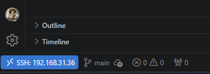

# Стартуем, практика 1
## Step 0: Подготовка
### Так как у меня есть старый ПК, подключенный к телеку, то я снёс с него винду и поставил Endevoure (сборка на Arch). 

    Я сначала наивно ставил сборку линукс второй системой. Но конечно же загрузчик винды решил умереть, попытка реанимировать через поиск нужных битов в памяти привела только к потере пары часов времени.

### Далее я понял, что хочу работать со своего основного ПК, поэтому создал локальное ssh подключение внутри VS Code к линукс машине. И уже через это подключение привязал гитхаб к ней же. 

### Ура, линукс - крутится, коммиты - мутятся! Пишем сервис на Go по ТЗ, с тремя эндпойнтами. 