# Стартуем, практика 1
## Step 0: Подготовка
### Так как у меня есть старый ПК, подключенный к телеку, то я снёс с него винду и поставил Endevoure (сборка на Arch). 

    Я сначала наивно ставил сборку линукс второй системой. Но конечно же загрузчик винды решил умереть, попытка реанимировать через поиск нужных битов в памяти привела только к потере пары часов времени.


### Далее я понял, что хочу работать со своего основного ПК, поэтому создал локальное ssh подключение внутри VS Code к линукс машине. И уже через это подключение привязал гитхаб к ней же. 


### Ура, линукс - крутится, коммиты - мутятся! 
Пишем сервис на Go по ТЗ, с тремя основными эндпойнтами. 
Еще добавил stopBurn, чтобы прервать бесконечный цикл burn. 

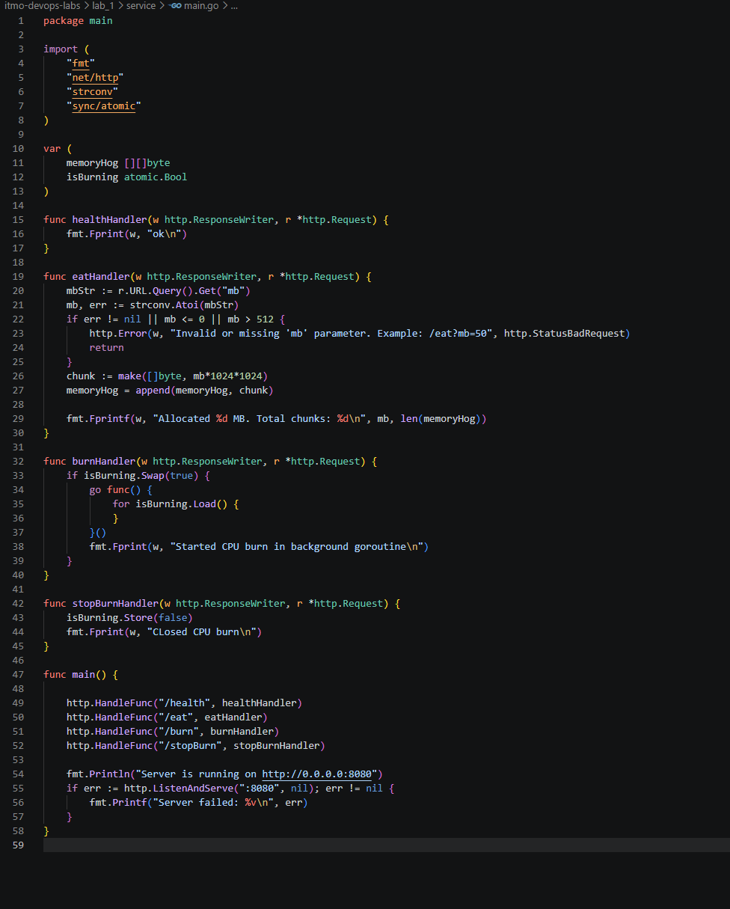

## Step 1: Запускаем локалхост, чекаем - жив ли наш сервис?

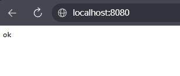

Отлично, /health отрабатывает штатно. 

#### Ищем PID нашего процесса: 
```bash
ps -ef
```

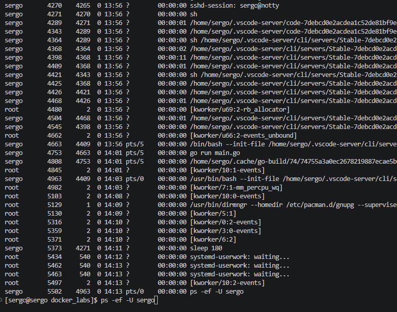

Наш сервис - go run main.go с PID 4753. Также вижу процессы как ssh подключения, так и процессы VS Code на хосте.
Оппа - я попался. go run main.go - это процесс обертка с временным бинарником. Кажется это процесс с PID 4808. 

Но лучше перезапущу сервис, собрав бинарник. /health отдает ок - отлично. 
Смотрим PID:

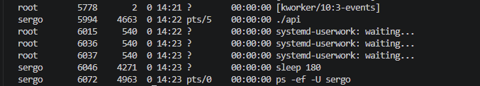

### Ага, вот и наш процесс сервиса "./api" с PID 5994.


## Step 2: Изучаем namespaces

### Создадим новое пространство имён следующей командой и сразу зададим имя хоста
```bash
unshare --pid --net --mount --uts --ipc --user --map-root-user --fork --mount-proc bash
hostname mycontainer
```
Смотрим что у нас по процессам внутри и название нашего хоста:

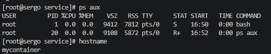

Отлично! Всего два процесса, причём наш bash стоит первым номером. 
А что по сетевым интерфейсам?

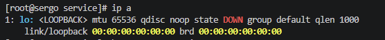

Пусто! Значит всё сделал верно. 
Также пользователь, который создавал пространство имён, теперь стал root пользователем внутри. 

Запускаем наш сервис внутри mycontainer и смотрим на хосте, какой PID назначен процессу.

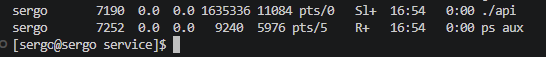

### Попався! PID нашего api - 7190

### А что за волшебные флаги я вводил, когда изолировал мой процесс?

- ```--pid``` - создаем наше новое пространство PID, где наш процесс будет самым главным на районе
- ```--net``` - изолируем сетевое пространство
- ```--mount``` - изолируем точки монтирования
- ```--uts``` - изолируем наш хост
- ```--ipc``` - изолируем межпроцессорное взаимодействие
- ```--user``` - изолируем наших юзеров внутри
- ```--map-root-user``` - отмечаем, что юзер, который создал этот контейнер, теперь имеет root права внутри него
- ```--fork``` - нужен, чтобы наш процесс bash был дочерним от нашего процесса unshare, и получил PID 1
- ```--mount-proc``` - конечно же монтируем новый /proc, иначе наш контейнер увидит все процессы хоста.

## Step 3: Cgroups - вводим диету для нашего процесса

Ага, снова всё как файлы - чтобы создать свою группу, нужно в ```/sys/fs/cgroup``` создать свою папочку с названием группы, а внутрь поместить файл ```.procs``` с PID процессов, которые принадлежат этой группе. 

Также в этой папке лежат наши лимиты, но с форматом ```.max```

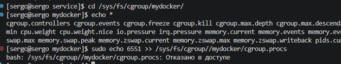

Такс, и что нам не нравится?

Юхху, оказывается если выполнить ```sudo echo "номер" >> "адрес"```, то root права на запись в файл ```>>``` уже не действуют, т.к. это следующая операция. Буду знать.

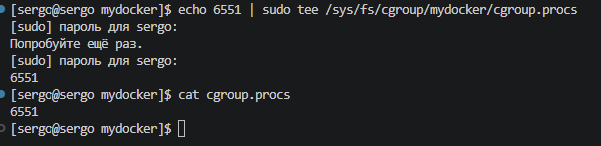

Устанавливаем лимиты на память, CPU и количество процессов. 

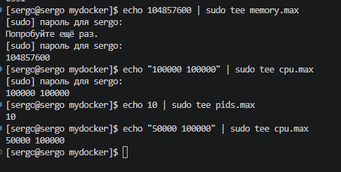

Я сначала выделил 1 ядро на группу, но в этом случае при burn не будет срабатывать тротлинг. Поэтому уменьшил до половины ядра.

Так, пробуем запустить сервис - и получаем failed. Кажется, проблема в сетевых интерфейсах.
Для этого мне нужен второй bash внутри пространства имен нашего контейнера. Для этого подойдет утилита ```nsenter```

Отлично, залезли в контейнер!

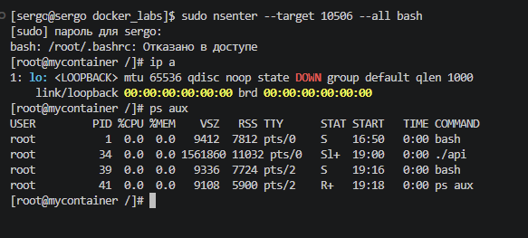

Так, локалхост по прежнему не работает. Гуглеж подсказал, что нужно включить сетевой интерфейс контейнера, делаем командой ```ip link set lo up```

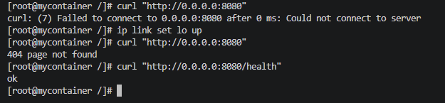

ЙООООО! Работает!


А теперь пробуем спровоцировать киллера, вжарим!

Так, я не смог выжать нужный мне лимит памяти. Почитал - у линукса есть оптимизация, которая может схлопывать участки памяти, заполненные нулями. Поэтому правлю код, чтобы он все физически забил единицами.

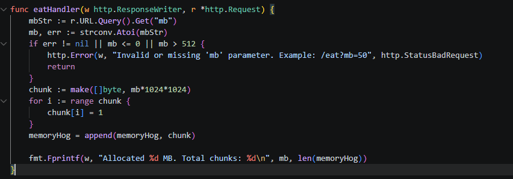

Перезапускаю сервис, заново прописываю новый PID и иду экспериментировать с лимитом на память.

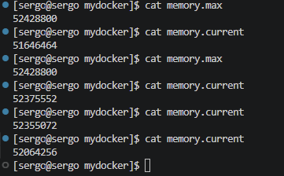

Снова укладывается в лимиты, да как так! Видимо включается механизм swap памяти (хитрец), попробую отключить его командой: ```echo 0 | sudo tee /sys/fs/cgroup/mydocker/memory.swap.max```

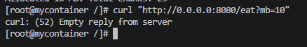

### Ураааа, уничтожен! Прикольно, что в cgroup.procs автоматом добавился PID запущенного процесса api.

Теперь пробуем увидеть тротлинг при прожарке, несколько раз запущу burn.

Чтобы посмотреть, появляется ли тротлинг ядра, смотрим статистику процессора для нашей группы. 

```cat /sys/fs/cgroup/mydocker/cpu.stat```

```bash 
usage_usec 220928336
user_usec 219825974
system_usec 1102361
nice_usec 0
core_sched.force_idle_usec 0
nr_periods 4754
nr_throttled 4396
throttled_usec 347167584
nr_bursts 0
burst_usec 0
```

Смотрим на:
- ```nr_periods 4754```- количество прошедших временных интервалов, периодов планирования. 
- ```nr_throttled 4396```- количество периодов, в которых происходило прерывание
- ```throttled_usec 347167584``` - время процесса в замороженном состоянии.

```bash
usage_usec 272330896
user_usec 271211837
system_usec 1119059
nice_usec 0
core_sched.force_idle_usec 0
nr_periods 5781
nr_throttled 5423
throttled_usec 501234795
nr_bursts 0
burst_usec 0
```
Метрика выросла, но сейчас понял, что и до того, как запустили burn, проц троттлил. Пробую увеличить лимит и перезапустить burn.

___
### Аххха, я решил продолжить лабу на следующий день, сейчас открыл консоль и понял что всё потёрлось)))

Всё восстановил. Идём дальше - лимит увеличил до полного ядра, смотрим статистику:

```bash 
usage_usec 35792
user_usec 22968
system_usec 12823
nice_usec 0
core_sched.force_idle_usec 0
nr_periods 10
nr_throttled 0
throttled_usec 0
nr_bursts 0
burst_usec 0
```

Оувоу, никакого троттлинга. Исправим это!

```bash 
usage_usec 67867300
user_usec 67825521
system_usec 41779
nice_usec 0
core_sched.force_idle_usec 0
nr_periods 690
nr_throttled 523
throttled_usec 181951850
nr_bursts 0
burst_usec 0
```

Теперь вижу, что троттлит - из 690 периодов, 523 были с прерыванием.

### Теперь пробуем запустить большое количество процессов. Нажму /burn еще 10 раз, у нас как раз лимит на 10 потоков.

Ага, интересное - процесс у нас один, это ./api: ```ps -ef```

```bash
UID          PID    PPID  C STIME TTY          TIME CMD
root           1       0  0 14:44 pts/0    00:00:00 bash
root          15       0  0 14:47 pts/2    00:00:00 bash
root         110       1 99 15:09 pts/0    00:02:59 ./api
root         129      15  0 15:10 pts/2    00:00:00 ps -ef
```


А потоков внутри у нас несколько: ```ps -T -p 110```

```bash
    PID    SPID TTY          TIME CMD
    110     110 pts/0    00:00:39 api
    110     111 pts/0    00:00:00 api
    110     112 pts/0    00:00:37 api
    110     113 pts/0    00:00:23 api
    110     114 pts/0    00:00:33 api
    110     115 pts/0    00:00:00 api
    110     118 pts/0    00:00:19 api
    110     121 pts/0    00:00:32 api
    110     122 pts/0    00:00:00 api
    110     124 pts/0    00:00:18 api
    110     126 pts/0    00:00:21 api
```

Тогда выпускаем нашу форм-бомбу ``` stress-ng --fork 15```

Так, несмотря на ограничение в ```pids.max``` в 10, у меня создалось 15 процессов. 
```bash
sergo      10382    5481  0 15:20 pts/2    00:00:00 stress-ng --fork 15
sergo      10383   10382 30 15:20 pts/2    00:00:24 stress-ng-fork
sergo      10384   10382 30 15:20 pts/2    00:00:24 stress-ng-fork
sergo      10385   10382 30 15:20 pts/2    00:00:23 stress-ng-fork
sergo      10386   10382 30 15:20 pts/2    00:00:24 stress-ng-fork
sergo      10387   10382 30 15:20 pts/2    00:00:24 stress-ng-fork
sergo      10388   10382 30 15:20 pts/2    00:00:24 stress-ng-fork
sergo      10389   10382 30 15:20 pts/2    00:00:23 stress-ng-fork
sergo      10390   10382 30 15:20 pts/2    00:00:24 stress-ng-fork
sergo      10391   10382 30 15:20 pts/2    00:00:24 stress-ng-fork
sergo      10392   10382 30 15:20 pts/2    00:00:24 stress-ng-fork
sergo      10393   10382 30 15:20 pts/2    00:00:23 stress-ng-fork
sergo      10397   10382 30 15:20 pts/2    00:00:24 stress-ng-fork
sergo      10398   10382 30 15:20 pts/2    00:00:23 stress-ng-fork
sergo      10402   10382 30 15:20 pts/2    00:00:24 stress-ng-fork
sergo      10404   10382 30 15:20 pts/2    00:00:23 stress-ng-fork
root      235465       2  0 15:21 ?        00:00:00 [kworker/10:2-events]
root      345820     540  0 15:21 ?        00:00:00 systemd-userwork: waiting...
root     1135733       2  0 15:22 ?        00:00:00 [kworker/4:0]
sergo    1159781    3547  0 15:22 pts/3    00:00:00 ps -ef
```

Понял, что т.к. я запускал вторую консоль bash, она не внеслась в группы cgroup.procs. Исправил это, запустил форк бомбу и вот что мы видим:
```bash
sergo    1868656    5481  0 15:29 pts/2    00:00:00 stress-ng --fork 15
sergo    1868657 1868656 14 15:29 pts/2    00:00:01 stress-ng-fork
sergo    1868658 1868656 14 15:29 pts/2    00:00:01 stress-ng-fork
sergo    1868659 1868656 14 15:29 pts/2    00:00:01 stress-ng-fork
sergo    1868660 1868656 14 15:29 pts/2    00:00:01 stress-ng-fork
sergo    1868661 1868656 14 15:29 pts/2    00:00:01 stress-ng-fork
sergo    1868662 1868656 14 15:29 pts/2    00:00:01 stress-ng-fork
sergo    1868663 1868656 14 15:29 pts/2    00:00:01 stress-ng-fork
```

Создано только 7 из 15 процессов. А ```cat pids.current``` показывает нам 10. 

Т.е. ограничение не дает размножиться процессам и наша форк бомба остановлена.

### Ура, переходим к шагу 4.

## Step 4: Раздаем права

У нас есть несколько опций, как регулировать права. 
- непосредственно capabilities, это порядка 40 отдельных прав. 
- seccomp, фильтр системных вызовов
- LSM, модули безопасности Linux. Это отдельный набор правил, централизованно заданный администратором на всю систему
- chroot, изоляция файловой системы

В лабе это не указано, но мне интересно просто потыкать, что такое chroot.

Вбиваю в консоль внутри контейнера: ```ls -la /```

```bash
итого 524360
dr-xr-xr-x  18 nobody nobody      4096 сен 14 21:36 .
dr-xr-xr-x  18 nobody nobody      4096 сен 14 21:36 ..
lrwxrwxrwx   1 nobody nobody         7 окт 12  2025 bin -> usr/bin
drwxr-xr-x   2 nobody nobody      4096 сен 17 22:41 boot
drwxr-xr-x  20 nobody nobody      4080 сен 23 11:05 dev
drwxr-x---   5 nobody nobody      4096 янв  1  1970 efi
drwxr-xr-x  90 nobody nobody     12288 сен 23 15:16 etc
drwxr-xr-x   3 nobody nobody      4096 сен 14 21:34 home
lrwxrwxrwx   1 nobody nobody         7 окт 12  2025 lib -> usr/lib
lrwxrwxrwx   1 nobody nobody         7 окт 12  2025 lib64 -> usr/lib
drwx------   2 nobody nobody     16384 сен 14 21:29 lost+found
drwxr-xr-x   2 nobody nobody      4096 окт 12  2025 mnt
drwxr-xr-x   2 nobody nobody      4096 окт 12  2025 opt
dr-xr-xr-x 383 nobody nobody         0 сен 23 14:44 proc
drwxr-x---   4 nobody nobody      4096 сен 14 21:36 root
drwxr-xr-x  33 nobody nobody       740 сен 23 11:05 run
lrwxrwxrwx   1 nobody nobody         7 окт 12  2025 sbin -> usr/bin
drwxr-xr-x   4 nobody nobody      4096 сен 14 21:33 srv
-rw-------   1 nobody nobody 536870912 сен 14 21:36 swapfile
dr-xr-xr-x  13 nobody nobody         0 сен 23 11:05 sys
drwxrwxrwt  14 nobody nobody       460 сен 23 11:45 tmp
drwxr-xr-x   9 nobody nobody      4096 сен 23 15:16 usr
drwxr-xr-x  13 nobody nobody      4096 сен 23 11:05 var
```

Получается, сейчас наш контейнер имеет доступ ко всей фаайловой системе хоста. А если вспомнить, что в Linux "Всё есть файл", то даже если ограничение прав не даст из нашего контейнера изменить эти файлы, то прочитать их и намусорить в папках он сможет. 

Поэтому создам папку для файловой системы контейнера: ```mkdir rootmydocker```

Установлю туда Alpine (как это делает и Docker). Внутри не будет ядра и GRUB, это минимальная файловая система. 

Команда ```wget https://dl-cdn.alpinelinux.org/alpine/v3.20/releases/x86_64/alpine-minirootfs-3.20.3-x86_64.tar.gz
tar -xzf alpine-minirootfs-*.tar.gz```

И сменяем наш корень файловой системы внутри контейнера: ```chroot ~/myrootfs /bin/sh```

Воу, а мой api то не запускается! Помощник мне подсказывает, что бинарник скорее всего собран под Arch Linux. А у Alpine совсем другая библиотека, поэтому нужно пересобрать бинарник, сделать его статически слинкованным. 

```CGO_ENABLED=0 go build -o api_static ```

Ура, всё запускается!

Смотрим теперь корень нашей файловой системы: ```/bin/ls -la /```.

```sh
total 76
drwxr-xr-x   19 root     root          4096 Sep 23 15:47 .
drwxr-xr-x   19 root     root          4096 Sep 23 15:47 ..
drwxr-xr-x    2 root     root          4096 Sep  6  2024 bin
drwxr-xr-x    2 root     root          4096 Sep  6  2024 dev
drwxr-xr-x   17 root     root          4096 Sep  6  2024 etc
drwxr-xr-x    2 root     root          4096 Sep 23 16:02 home
drwxr-xr-x    6 root     root          4096 Sep  6  2024 lib
drwxr-xr-x    5 root     root          4096 Sep  6  2024 media
drwxr-xr-x    2 root     root          4096 Sep  6  2024 mnt
drwxr-xr-x    2 root     root          4096 Sep  6  2024 opt
dr-xr-xr-x    2 root     root          4096 Sep  6  2024 proc
drwx------    2 root     root          4096 Sep 23 15:54 root
drwxr-xr-x    2 root     root          4096 Sep  6  2024 run
drwxr-xr-x    2 root     root          4096 Sep  6  2024 sbin
drwxr-xr-x    2 root     root          4096 Sep  6  2024 srv
drwxr-xr-x    2 root     root          4096 Sep  6  2024 sys
drwxr-xr-x    2 root     root          4096 Sep  6  2024 tmp
drwxr-xr-x    7 root     root          4096 Sep  6  2024 usr
drwxr-xr-x   12 root     root          4096 Sep  6  2024 var
```

Отлично, это папки, внутри папки rootmydocker, и контейнер думает, что это корень файловой системы.

### Теперь приступим к capabilities

Посмотрим, какие права у меня есть у контейнера, в bash на хосте, для этого смотрим proc/<PID моего процесса>

```grep Cap /proc/4965/status```

```bash
CapInh: 0000000000000000
CapPrm: 000001ffffffffff
CapEff: 000001ffffffffff
CapBnd: 000001ffffffffff
CapAmb: 0000000000000000
```

Теперь это надо декодировать:
```capsh --decode=000001ffffffffff```
```bash
0x000001ffffffffff=cap_chown,cap_dac_override,cap_dac_read_search,cap_fowner,cap_fsetid,cap_kill,cap_setgid,cap_setuid,cap_setpcap,cap_linux_immutable,cap_net_bind_service,cap_net_broadcast,cap_net_admin,cap_net_raw,cap_ipc_lock,cap_ipc_owner,cap_sys_module,cap_sys_rawio,cap_sys_chroot,cap_sys_ptrace,cap_sys_pacct,cap_sys_admin,cap_sys_boot,cap_sys_nice,cap_sys_resource,cap_sys_time,cap_sys_tty_config,cap_mknod,cap_lease,cap_audit_write,cap_audit_control,cap_setfcap,cap_mac_override,cap_mac_admin,cap_syslog,cap_wake_alarm,cap_block_suspend,cap_audit_read,cap_perfmon,cap_bpf,cap_checkpoint_restore
```
И мы видим, что у нас доступны ВСЕ права!

Идём внутрь контейнера и пробуем изменить время:
```date -s "12:34:56"```
```bash
date: невозможно установить дату: Операция не позволена
Ср 23 сен 2026 12:34:56 MSK
[root@mycontainer /]#  date
Ср 23 сен 2026 19:40:13 MSK
```

Ага, меня бьют по рукам. Причем, права то на бумаге есть, но из-за того, что запускали контейнер с пространством пользователя -user, линукс считает нас за обычного юзера. 

Теперь перезапустим контейнер, но уже пропустив -U 